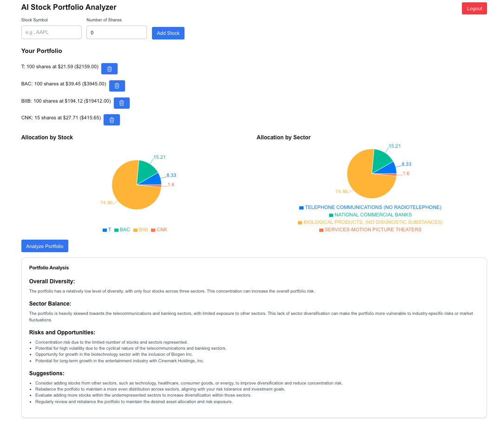

# AI Stock Portfolio Analyzer

This application allows you to enter stock ticker symbols
to build a stock portfolio, and then use AI to anaylze the portfolio.

## Notes

This application was submitted as a capstone project for
[Dan Bowden](https://github.com/thedewpoint)'s [Full Stack Expert](https://www.fullstackexpert.io/)
class.


## Tech Stack used

* [Next.js](https://nextjs.org)
* [React](https://react.dev)
* [Auth.js](https://authjs.dev)
* [Drizzle ORM](https://orm.drizzle.team) with Postgres database
* [Polygon.io](https://polygon.io) for Stock market data 
* [Anthropic Claude](https://claude.ai) for AI
* [Vercel](https://vercel.com)
* [Supabase](https://supabase.com)

## Getting Started

First, run the development server:

```bash
pnpm install
pnpm dev
```

Open [http://localhost:3000](http://localhost:3000) with your browser to see the result.

## Screenshots




## TODO

* Optimize code to deal with 429 rate limit errors from Polygon
* More robust error handling when failing to look up stock ticker
